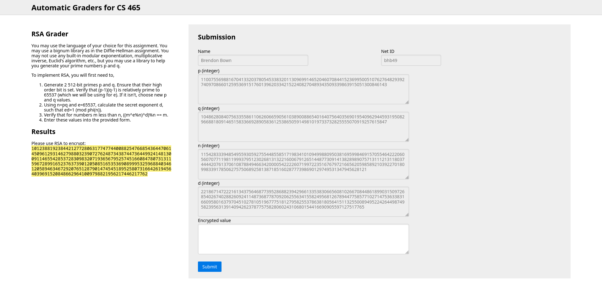
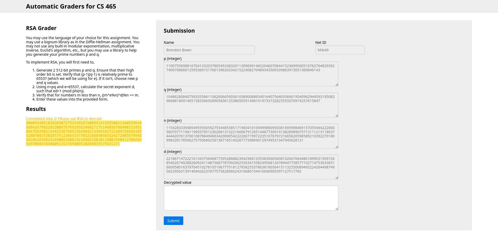
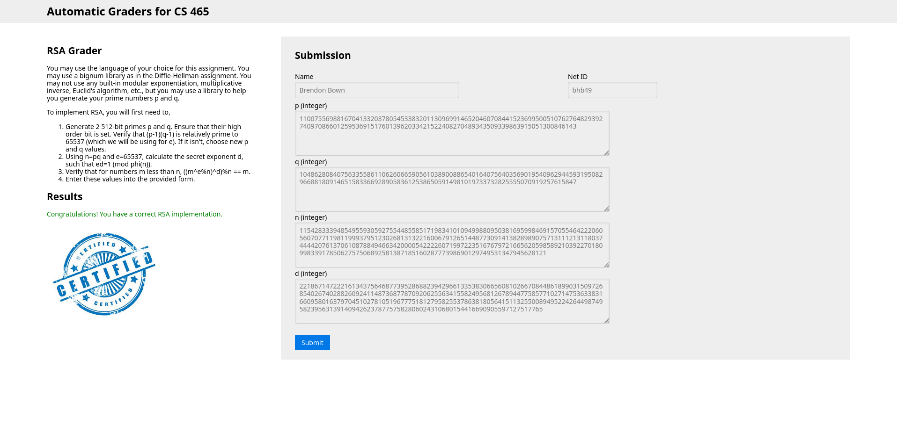

# RSA

## Compile and Run

To compile and run the code, install rust and cargo, then run `cargo run` in the root directory
of the project. (The root directory is the one with the `Cargo.toml` file in it.)

## Process Logs

The process of calculating the different values is found in [results.log](./results.log).

## Autograder

Valid `d` value:

Successful encryption:

Successful decryption:
